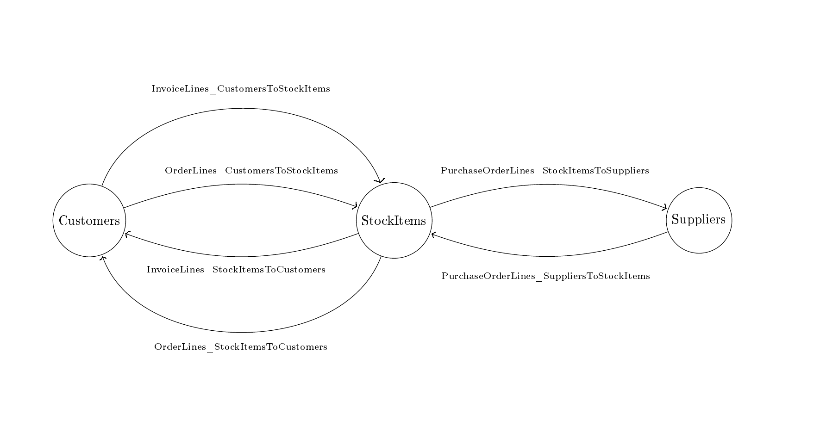

# Graph Tables
This code sample demonstrates how to populate graph tables from an existing table or a csv files. It provides a couple of examples as well.

### Contents

[About this sample](#about-this-sample) 
[Before you begin](#before-you-begin) 
[Run this sample](#run-this-sample) 
[Sample details](#sample-details) 
[Disclaimers](#disclaimers) 
[Related links](#related-links) 

## About this sample

1. **Applies to:**
	- Azure SQL Database v12 (or higher) Standard / Premium / Premium RS service tiers.
	- SQL Server 2017 (or higher) Evaluation / Developer / Enterprise editions.
2. **Key feature:**
	- populating graph tables
	- graph in filter clauses
3. **Workload:**  Transactional queries executed on [WideWorldImporters](https://github.com/Microsoft/sql-server-samples/releases/tag/wide-world-importers-v1.0)
4. **Programming Language:** Pyhton, T-SQL
5. **Authors:** Estienne Granet [esgranet-msft]

## Before you begin

To run this sample, you need the following prerequisites.

**Account and Software prerequisites:**

1. Either
	- Azure SQL Database v12 (or higher) and Azure Blob Storage
	- SQL Server 2017 (or higher)
2. SQL Server Management Studio 17.1 (or higher)
3. Python 3.6 (or higher)

**Azure prerequisites:**

1. Permission to create an Azure SQL Database. For further explanation on how to create an Azure SQL Database and access it from SQL Server Management Studio, you can refer to this [tutorial](https://docs.microsoft.com/en-us/azure/sql-database/sql-database-design-first-database).

2. Permission to create an Azure blob container. 

## Run this sample

### Setup

#### Azure SQL Database Setup

1. Download **WideWorldImporters-Standard.bacpac** from the WideWorldImporters [page](https://github.com/Microsoft/sql-server-samples/releases/tag/wide-world-importers-v1.0).

2. Log into the Azure portal and go to your Azure Storage account. You will need to upload **WideWorldImporters-Standard.bacpac** to a blob container. To do so, go on the home page of your Azure storage account, click on the __Blobs__ icon located under the __Services__ tab and select ** + Container** to create a new blob container. Alternatively, you can choose an existing blob container. There, upload **WideWorldImporters-Standard.bacpac**. When prompted for a blob type and a blob size, choose respectively **Block blob** and **100MB**.

3. Go to your Azure SQL Server account to import the newly uploaded **WideWorldImporters-Standard.bacpac** database from your Azure storage account. To do so, click **Import database** on the top ribbon and fill the different fields required to import a new database. Under the section Storage, select your storage account and the blob container that you just used to upload **WideWorldImporters-Standard.bacpac**. Select the **WideWorldImporters-Standard.bacpac** file. Choose a Standard S0 or higher pricing tier. Name the database "WideWorldImporters-Standard" and provide your credentials. For screenshots on the import operation, please refer to this documentation (page)[https://docs.microsoft.com/en-us/azure/sql-database/sql-database-import].

4. Launch SQL Server Management Studio and connect to the newly created WideWorldImporters-Standard database.

#### SQL Server Setup

1. Download **WideWorldImporters-Full.bak** from the WideWorldImporters [page](https://github.com/Microsoft/sql-server-samples/releases/tag/wide-world-importers-v1.0).

2. Launch SQL Server Management Studio, connect to your SQL Server instance and restore **WideWorldImporters-Full.bak**. For detailed information on how to restore a database backup file from SQL Server Management Studio, you can refer to this documentation [page](https://docs.microsoft.com/en-us/sql/relational-databases/backup-restore/restore-a-database-backup-using-ssms). Finally run "USE WideWorldImporters; GO" to use WideWorldImporters.

### Create and populate graph tables

The first step will consist in creating graph tables. This is the purpose of **create_graph_tables.sql**. **create_graph_tables.sql** creates node equivalent of Sales.Customers, Warehouse.StockItems and Purchasing.Suppliers. On top, it creates six edge tables between these node tables. Please keep in mind that all graph edges are oriented, meaning that an edge table from Node Table A to Node Table B is not equivalent to an edge table from Node Table B to Node Table A. The second step is to populate the graph tables that you have just created. This is the purpose of **populate_graph_tables.sql**.

On a side note, a quick way to create an edge table from an existing table is to go on the **Object Explorer** of SQL Server Management Studio, select the table that you would like to convert and right click on it. Select **Script Table**, **CREATE TO** and then **New Query Editor Window**. This will open a window with a T-SQL CREATE script for the table. As **AS NODE ** at the end of the statement to declare the table as a graph table. A live demonstration of this method is presented in this [video]().

To improve performance, **populate_graph_tables.sql** disables default indexes during the insert operations and rebuilds them at the end. This avoids the constant update of indexes while data is inserted in the table. Below is an image of the graph layout.

### Query graph tables

**top_10_buyers.sql** finds the top 10 buyers who purchased a specific item ordered by how much they spent. customers_who_bought_this_also_bought.sql lists all the items purchased by customers who bought item X.

### Import a csv file as a node table using the bcp utility.

csv_as_node.sql and csv_as_node.py show how to import a csv file into a node table. Specifically, they add a \$node_id column to the csv file and export it back into a graph table. For the sake of the example, csv_as_node.sql

In addition to disabling default indexes during the bulk insert operations, we also set the recovery mode to **bulk_logged** in order to increase performance.

### Import a csv file as a node table using the openrowset bulk.

openrowset_bulk_insert.sql retreives a table from a csv file and import it into a node table using (openrowset)[https://docs.microsoft.com/en-us/sql/t-sql/functions/openrowset-transact-sql].

## Disclaimers
The code included in this sample is not intended to be a set of best practices on how to build scalable enterprise grade applications. This is beyond the scope of this quick start sample.

## Related Links

For more information, see these articles:
- [Graph processing with SQL Server 2017] (https://docs.microsoft.com/en-us/sql/relational-databases/graphs/sql-graph-overview)
- [SQL Graph Architecture] (https://docs.microsoft.com/en-us/sql/relational-databases/graphs/sql-graph-architecture)
- [WideWorldImporters] (https://github.com/Microsoft/sql-server-samples/releases/tag/wide-world-importers-v1.0)
